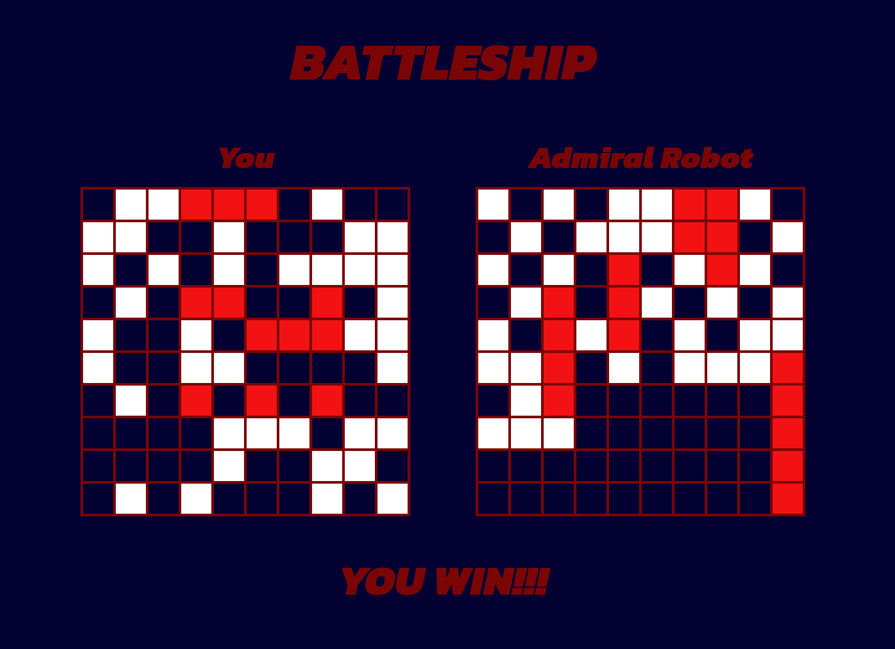

# battleship

Project from [The Odin Project](https://www.theodinproject.com/)

## [Live Demo](https://gustav72.github.io/battleship/)

### Technologies Used

JavaScript

Jest

HTML5

CSS3

Git

### Overview

This Battleship game project involves DOM manipulation with modular JavaScript using Test Driven Development with the Jest Framework. Unit tests were created to assure proper function behavior. The ship placement is randomly generated before the game begins. The user can attack the enemies board. After a user attacks, the computer takes a turn to randomly attack the players board. Messages are displayed for the players attack outcome and also to alert the end of the game and its outcome. This project was a lot of fun.

Future improvements would be to add fun animations and also add more details displaying the current state of the game like saying which ship jsut got sunk. Further improvements to the computer player such as making it attack nearby squares once a hit is made.

Thank You for taking the time to look at my work!
